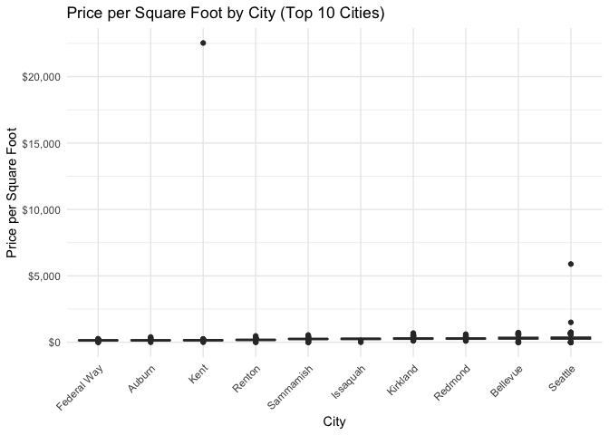
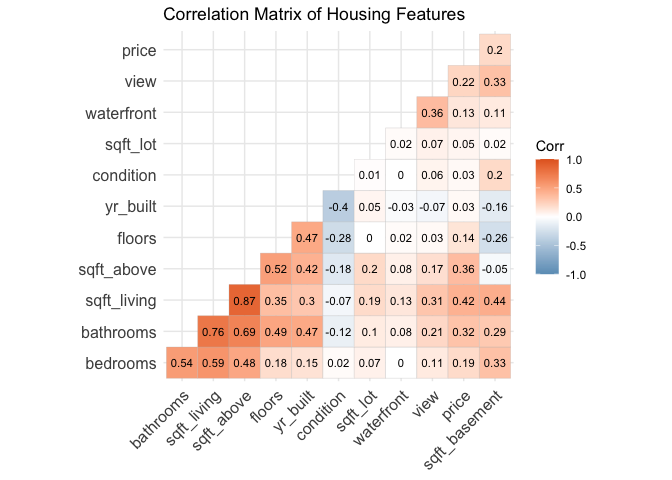
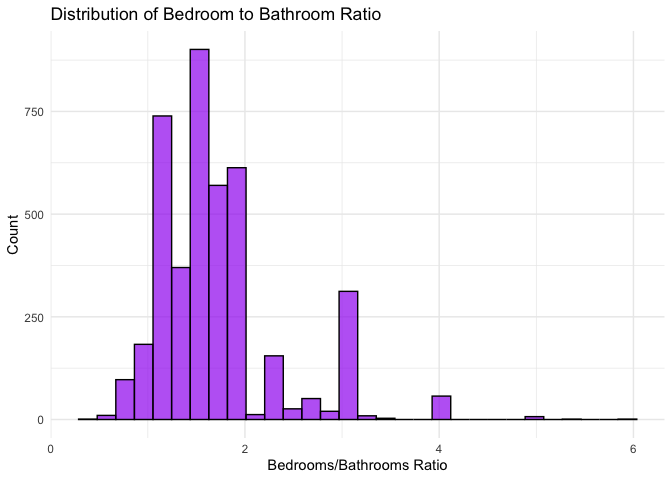

README
================

# Understanding the Data

## Temporal Context

- **When was the data acquired?**
  - Based on our analysis, the data appears to be from 2014. Specifically, we observed that all the date entries in the sample begin with “2014-05-09” format. This suggests the dataset represents a snapshot of the housing market around May to July of 2014, rather than a time series spanning multiple years.

## Geographic Scope

- **Where was the data acquired?**
  - The dataset covers housing properties in the state of Washington (WA), primarily in the Seattle metropolitan area and surrounding regions.

## Data Collection Method

- **How was the data acquired?**
  - The dataset doesn’t explicitly state its source, but based on the structured nature and comprehensive property details, it appears to be compiled from real estate transaction records or multiple listing service (MLS) data. It likely represents actual home sales rather than listings or estimates.

## Dataset Attributes

- **What are the attributes of this dataset?**
  - The date of transaction, sale price, number of bedrooms and bathrooms, interior square footage, land square footage, number of floors, whether or not it is a waterfront property, quality of its view, the condition as a rating, square footage above ground level, square footage of basement, the year it was built, the year it was renovated, and its address including its street name, city, state, zip code, and country.

## Data Types

- **What type of data do these attributes contain?**
  - **Nominal**: street name, city, state, zip code, and country
  - **Ordinal**: view, condition and waterfront
  - **Numerical (interval)**: sale price, number of bedrooms and bathrooms, interior square footage, land square footage, number of floors, square footage above ground level, and square footage of basement
  - **Numerical (ratio)**: the year it was built, the year it was renovated, and date of transaction

``` r
# Define the Kaggle dataset URL
url <- "https://www.kaggle.com/api/v1/datasets/download/fratzcan/usa-house-prices"

# Define the destination file path
destfile <- "./usa-house-prices.zip"

# Download the file
download.file(url, destfile, mode = "wb")

# Print a message indicating completion
cat("Download complete! File saved to:", destfile, "\n")
```

    ## Download complete! File saved to: ./usa-house-prices.zip

``` r
# Load necessary libraries
library(tidyverse)
```

    ## ── Attaching core tidyverse packages ──────────────────────── tidyverse 2.0.0 ──
    ## ✔ dplyr     1.1.4     ✔ readr     2.1.5
    ## ✔ forcats   1.0.0     ✔ stringr   1.5.1
    ## ✔ ggplot2   3.5.1     ✔ tibble    3.2.1
    ## ✔ lubridate 1.9.4     ✔ tidyr     1.3.1
    ## ✔ purrr     1.0.4     
    ## ── Conflicts ────────────────────────────────────────── tidyverse_conflicts() ──
    ## ✖ dplyr::filter() masks stats::filter()
    ## ✖ dplyr::lag()    masks stats::lag()
    ## ℹ Use the conflicted package (<http://conflicted.r-lib.org/>) to force all conflicts to become errors

``` r
library(naniar)      # For missing data visualization
library(ggcorrplot)  # For correlation plots
library(gridExtra)   # For arranging multiple plots
```

    ## 
    ## Attaching package: 'gridExtra'
    ## 
    ## The following object is masked from 'package:dplyr':
    ## 
    ##     combine

``` r
library(scales)      # For formatting labels
```

    ## 
    ## Attaching package: 'scales'
    ## 
    ## The following object is masked from 'package:purrr':
    ## 
    ##     discard
    ## 
    ## The following object is masked from 'package:readr':
    ## 
    ##     col_factor

``` r
# Read the dataset
# Assuming the CSV file is in the working directory
housing_data <- read.csv("USA Housing Dataset.csv")

# 1. Basic Structure and Overview
# ----------------------------------
# Display dataset structure
str(housing_data)
```

    ## 'data.frame':    4140 obs. of  18 variables:
    ##  $ date         : chr  "2014-05-09 00:00:00" "2014-05-09 00:00:00" "2014-05-09 00:00:00" "2014-05-09 00:00:00" ...
    ##  $ price        : num  376000 800000 2238888 324000 549900 ...
    ##  $ bedrooms     : num  3 4 5 3 5 3 4 4 3 4 ...
    ##  $ bathrooms    : num  2 3.25 6.5 2.25 2.75 2.5 2 1 2.5 2.5 ...
    ##  $ sqft_living  : int  1340 3540 7270 998 3060 2130 2520 1940 1350 2160 ...
    ##  $ sqft_lot     : int  1384 159430 130017 904 7015 6969 6000 9533 1250 5298 ...
    ##  $ floors       : num  3 2 2 2 1 2 1 1 3 2.5 ...
    ##  $ waterfront   : int  0 0 0 0 0 0 0 0 0 0 ...
    ##  $ view         : int  0 0 0 0 0 0 0 0 0 0 ...
    ##  $ condition    : int  3 3 3 3 5 3 3 3 3 4 ...
    ##  $ sqft_above   : int  1340 3540 6420 798 1600 2130 1400 1080 1270 2160 ...
    ##  $ sqft_basement: int  0 0 850 200 1460 0 1120 860 80 0 ...
    ##  $ yr_built     : int  2008 2007 2010 2007 1979 2003 1921 1962 2006 1902 ...
    ##  $ yr_renovated : int  0 0 0 0 0 0 2007 2003 0 0 ...
    ##  $ street       : chr  "9245-9249 Fremont Ave N" "33001 NE 24th St" "7070 270th Pl SE" "820 NW 95th St" ...
    ##  $ city         : chr  "Seattle" "Carnation" "Issaquah" "Seattle" ...
    ##  $ statezip     : chr  "WA 98103" "WA 98014" "WA 98029" "WA 98117" ...
    ##  $ country      : chr  "USA" "USA" "USA" "USA" ...

``` r
# Display first few rows
head(housing_data)
```

    ##                  date   price bedrooms bathrooms sqft_living sqft_lot floors
    ## 1 2014-05-09 00:00:00  376000        3      2.00        1340     1384      3
    ## 2 2014-05-09 00:00:00  800000        4      3.25        3540   159430      2
    ## 3 2014-05-09 00:00:00 2238888        5      6.50        7270   130017      2
    ## 4 2014-05-09 00:00:00  324000        3      2.25         998      904      2
    ## 5 2014-05-10 00:00:00  549900        5      2.75        3060     7015      1
    ## 6 2014-05-10 00:00:00  320000        3      2.50        2130     6969      2
    ##   waterfront view condition sqft_above sqft_basement yr_built yr_renovated
    ## 1          0    0         3       1340             0     2008            0
    ## 2          0    0         3       3540             0     2007            0
    ## 3          0    0         3       6420           850     2010            0
    ## 4          0    0         3        798           200     2007            0
    ## 5          0    0         5       1600          1460     1979            0
    ## 6          0    0         3       2130             0     2003            0
    ##                       street         city statezip country
    ## 1    9245-9249 Fremont Ave N      Seattle WA 98103     USA
    ## 2           33001 NE 24th St    Carnation WA 98014     USA
    ## 3           7070 270th Pl SE     Issaquah WA 98029     USA
    ## 4             820 NW 95th St      Seattle WA 98117     USA
    ## 5          10834 31st Ave SW      Seattle WA 98146     USA
    ## 6 Cedar to Green River Trail Maple Valley WA 98038     USA

``` r
# Basic dimensions
cat("Dataset dimensions:", dim(housing_data)[1], "rows and", dim(housing_data)[2], "columns\n")
```

    ## Dataset dimensions: 4140 rows and 18 columns

``` r
# 2. Summary Statistics
# ---------------------
# Numerical variable summaries
numerical_summary <- housing_data %>%
  select(price, bedrooms, bathrooms, sqft_living, sqft_lot, floors, 
         waterfront, view, condition, sqft_above, sqft_basement, 
         yr_built, yr_renovated) %>%
  summary()

print(numerical_summary)
```

    ##      price             bedrooms     bathrooms      sqft_living   
    ##  Min.   :       0   Min.   :0.0   Min.   :0.000   Min.   :  370  
    ##  1st Qu.:  320000   1st Qu.:3.0   1st Qu.:1.750   1st Qu.: 1470  
    ##  Median :  460000   Median :3.0   Median :2.250   Median : 1980  
    ##  Mean   :  553063   Mean   :3.4   Mean   :2.163   Mean   : 2144  
    ##  3rd Qu.:  659125   3rd Qu.:4.0   3rd Qu.:2.500   3rd Qu.: 2620  
    ##  Max.   :26590000   Max.   :8.0   Max.   :6.750   Max.   :10040  
    ##     sqft_lot           floors        waterfront            view       
    ##  Min.   :    638   Min.   :1.000   Min.   :0.000000   Min.   :0.0000  
    ##  1st Qu.:   5000   1st Qu.:1.000   1st Qu.:0.000000   1st Qu.:0.0000  
    ##  Median :   7676   Median :1.500   Median :0.000000   Median :0.0000  
    ##  Mean   :  14698   Mean   :1.514   Mean   :0.007488   Mean   :0.2466  
    ##  3rd Qu.:  11000   3rd Qu.:2.000   3rd Qu.:0.000000   3rd Qu.:0.0000  
    ##  Max.   :1074218   Max.   :3.500   Max.   :1.000000   Max.   :4.0000  
    ##    condition       sqft_above   sqft_basement       yr_built   
    ##  Min.   :1.000   Min.   : 370   Min.   :   0.0   Min.   :1900  
    ##  1st Qu.:3.000   1st Qu.:1190   1st Qu.:   0.0   1st Qu.:1951  
    ##  Median :3.000   Median :1600   Median :   0.0   Median :1976  
    ##  Mean   :3.452   Mean   :1831   Mean   : 312.3   Mean   :1971  
    ##  3rd Qu.:4.000   3rd Qu.:2310   3rd Qu.: 602.5   3rd Qu.:1997  
    ##  Max.   :5.000   Max.   :8020   Max.   :4820.0   Max.   :2014  
    ##   yr_renovated   
    ##  Min.   :   0.0  
    ##  1st Qu.:   0.0  
    ##  Median :   0.0  
    ##  Mean   : 808.4  
    ##  3rd Qu.:1999.0  
    ##  Max.   :2014.0

``` r
# Calculate standard deviation, range, etc. for numerical variables
detailed_stats <- housing_data %>%
  select(price, bedrooms, bathrooms, sqft_living, sqft_lot, floors, 
         waterfront, view, condition, sqft_above, sqft_basement, 
         yr_built, yr_renovated) %>%
  summarise(across(everything(), 
                  list(
                    mean = ~mean(., na.rm = TRUE),
                    median = ~median(., na.rm = TRUE),
                    min = ~min(., na.rm = TRUE),
                    max = ~max(., na.rm = TRUE),
                    range = ~max(., na.rm = TRUE) - min(., na.rm = TRUE),
                    sd = ~sd(., na.rm = TRUE),
                    n_missing = ~sum(is.na(.))
                  )))

print(detailed_stats)
```

    ##   price_mean price_median price_min price_max price_range price_sd
    ## 1   553062.9       460000         0  26590000    26590000 583686.5
    ##   price_n_missing bedrooms_mean bedrooms_median bedrooms_min bedrooms_max
    ## 1               0      3.400483               3            0            8
    ##   bedrooms_range bedrooms_sd bedrooms_n_missing bathrooms_mean bathrooms_median
    ## 1              8   0.9039388                  0       2.163043             2.25
    ##   bathrooms_min bathrooms_max bathrooms_range bathrooms_sd bathrooms_n_missing
    ## 1             0          6.75            6.75     0.784733                   0
    ##   sqft_living_mean sqft_living_median sqft_living_min sqft_living_max
    ## 1         2143.639               1980             370           10040
    ##   sqft_living_range sqft_living_sd sqft_living_n_missing sqft_lot_mean
    ## 1              9670       957.4816                     0      14697.64
    ##   sqft_lot_median sqft_lot_min sqft_lot_max sqft_lot_range sqft_lot_sd
    ## 1            7676          638      1074218        1073580    35876.84
    ##   sqft_lot_n_missing floors_mean floors_median floors_min floors_max
    ## 1                  0     1.51413           1.5          1        3.5
    ##   floors_range floors_sd floors_n_missing waterfront_mean waterfront_median
    ## 1          2.5 0.5349409                0     0.007487923                 0
    ##   waterfront_min waterfront_max waterfront_range waterfront_sd
    ## 1              0              1                1    0.08621861
    ##   waterfront_n_missing view_mean view_median view_min view_max view_range
    ## 1                    0 0.2466184           0        0        4          4
    ##     view_sd view_n_missing condition_mean condition_median condition_min
    ## 1 0.7906195              0       3.452415                3             1
    ##   condition_max condition_range condition_sd condition_n_missing
    ## 1             5               4    0.6785332                   0
    ##   sqft_above_mean sqft_above_median sqft_above_min sqft_above_max
    ## 1        1831.351              1600            370           8020
    ##   sqft_above_range sqft_above_sd sqft_above_n_missing sqft_basement_mean
    ## 1             7650      861.3829                    0           312.2874
    ##   sqft_basement_median sqft_basement_min sqft_basement_max sqft_basement_range
    ## 1                    0                 0              4820                4820
    ##   sqft_basement_sd sqft_basement_n_missing yr_built_mean yr_built_median
    ## 1         464.3492                       0      1970.814            1976
    ##   yr_built_min yr_built_max yr_built_range yr_built_sd yr_built_n_missing
    ## 1         1900         2014            114    29.80794                  0
    ##   yr_renovated_mean yr_renovated_median yr_renovated_min yr_renovated_max
    ## 1          808.3684                   0                0             2014
    ##   yr_renovated_range yr_renovated_sd yr_renovated_n_missing
    ## 1               2014        979.3805                      0

``` r
# 3. Missing Value Analysis
# -------------------------
# Check for missing values
missing_values <- colSums(is.na(housing_data))
cat("Missing values per column:\n")
```

    ## Missing values per column:

``` r
print(missing_values)
```

    ##          date         price      bedrooms     bathrooms   sqft_living 
    ##             0             0             0             0             0 
    ##      sqft_lot        floors    waterfront          view     condition 
    ##             0             0             0             0             0 
    ##    sqft_above sqft_basement      yr_built  yr_renovated        street 
    ##             0             0             0             0             0 
    ##          city      statezip       country 
    ##             0             0             0

``` r
# Visualize missing data pattern (if there are missing values)
if(sum(missing_values) > 0) {
  miss_plot <- gg_miss_var(housing_data) + 
    labs(title = "Missing Values by Variable")
  print(miss_plot)
}
```

``` r
# 4. Calculate price per square foot
# ---------------------------------
housing_data$price_per_sqft <- housing_data$price / housing_data$sqft_living

# Get the top 10 cities by count
top_cities <- names(sort(table(housing_data$city), decreasing = TRUE)[1:10])

# Filter for those cities
city_data <- housing_data %>%
  filter(city %in% top_cities)

# Box plot of price per square foot by city
p11 <- ggplot(city_data, aes(x = reorder(city, price_per_sqft, FUN = median), y = price_per_sqft)) +
  geom_boxplot(fill = "lightblue") +
  scale_y_continuous(labels = scales::dollar_format()) +
  labs(title = "Price per Square Foot by City (Top 10 Cities)", 
       x = "City", 
       y = "Price per Square Foot") +
  theme_minimal() +
  theme(axis.text.x = element_text(angle = 45, hjust = 1))

print(p11)
```

<!-- -->

``` r
# 5. Correlation Analysis
# ----------------------
# Create correlation matrix for numerical variables
corr_vars <- housing_data %>%
  select(price, bedrooms, bathrooms, sqft_living, sqft_lot, floors, 
         waterfront, view, condition, sqft_above, sqft_basement, yr_built)

correlation_matrix <- cor(corr_vars, use = "complete.obs")
print(correlation_matrix)
```

    ##                    price     bedrooms   bathrooms sqft_living     sqft_lot
    ## price         1.00000000  0.188765142  0.31778537  0.41852804  0.045964114
    ## bedrooms      0.18876514  1.000000000  0.54254861  0.59010981  0.065746672
    ## bathrooms     0.31778537  0.542548608  1.00000000  0.76035347  0.097497448
    ## sqft_living   0.41852804  0.590109813  0.76035347  1.00000000  0.194226060
    ## sqft_lot      0.04596411  0.065746672  0.09749745  0.19422606  1.000000000
    ## floors        0.14318033  0.178908025  0.48746202  0.34512959 -0.001112735
    ## waterfront    0.13140126 -0.001286433  0.08015190  0.12615741  0.019229232
    ## view          0.21755312  0.105511845  0.21059005  0.30809811  0.071264029
    ## condition     0.03032722  0.016502829 -0.12302399 -0.06931461  0.012016272
    ## sqft_above    0.35521393  0.478124189  0.68767943  0.87488138  0.203190003
    ## sqft_basement 0.20406557  0.329862245  0.29217050  0.43905256  0.023567347
    ## yr_built      0.02706675  0.153513567  0.47081384  0.29654499  0.047224097
    ##                     floors   waterfront        view    condition  sqft_above
    ## price          0.143180328  0.131401260  0.21755312  0.030327216  0.35521393
    ## bedrooms       0.178908025 -0.001286433  0.10551184  0.016502829  0.47812419
    ## bathrooms      0.487462017  0.080151904  0.21059005 -0.123023992  0.68767943
    ## sqft_living    0.345129590  0.126157414  0.30809811 -0.069314611  0.87488138
    ## sqft_lot      -0.001112735  0.019229232  0.07126403  0.012016272  0.20319000
    ## floors         1.000000000  0.021278110  0.03060383 -0.275212288  0.52477696
    ## waterfront     0.021278110  1.000000000  0.35923652  0.004027085  0.08107594
    ## view           0.030603835  0.359236521  1.00000000  0.064440140  0.16727035
    ## condition     -0.275212288  0.004027085  0.06444014  1.000000000 -0.18359889
    ## sqft_above     0.524776955  0.081075940  0.16727035 -0.183598893  1.00000000
    ## sqft_basement -0.261825961  0.109736316  0.32500205  0.197656172 -0.05103939
    ## yr_built       0.470138622 -0.031891233 -0.06785850 -0.400394294  0.41652546
    ##               sqft_basement    yr_built
    ## price            0.20406557  0.02706675
    ## bedrooms         0.32986225  0.15351357
    ## bathrooms        0.29217050  0.47081384
    ## sqft_living      0.43905256  0.29654499
    ## sqft_lot         0.02356735  0.04722410
    ## floors          -0.26182596  0.47013862
    ## waterfront       0.10973632 -0.03189123
    ## view             0.32500205 -0.06785850
    ## condition        0.19765617 -0.40039429
    ## sqft_above      -0.05103939  0.41652546
    ## sqft_basement    1.00000000 -0.16119668
    ## yr_built        -0.16119668  1.00000000

``` r
# Visualize correlation matrix
p12 <- ggcorrplot(correlation_matrix, 
           hc.order = TRUE, 
           type = "lower", 
           lab = TRUE, 
           lab_size = 3,
           colors = c("#6D9EC1", "white", "#E46726")) +
  labs(title = "Correlation Matrix of Housing Features")

print(p12)
```

<!-- -->

``` r
# 6. Outlier Detection
# ------------------
# Calculate z-scores for price
housing_data$price_zscore <- (housing_data$price - mean(housing_data$price)) / sd(housing_data$price)

# Identify outliers (z-score > 3 or < -3)
price_outliers <- housing_data %>%
  filter(abs(price_zscore) > 3) %>%
  select(price, bedrooms, bathrooms, sqft_living, city, price_zscore) %>%
  arrange(desc(price_zscore))

cat("Number of price outliers:", nrow(price_outliers), "\n")
```

    ## Number of price outliers: 26

``` r
print(head(price_outliers, 10))
```

    ##       price bedrooms bathrooms sqft_living          city price_zscore
    ## 1  26590000        3      2.00        1180          Kent    44.607746
    ## 2  12899000        3      2.50        2190       Seattle    21.151660
    ## 3   7062500        5      4.50       10040      Bellevue    11.152284
    ## 4   4668000        5      6.75        9640 Mercer Island     7.049910
    ## 5   4489000        4      3.00        6430      Bellevue     6.743239
    ## 6   3800000        5      5.50        7050    Clyde Hill     5.562810
    ## 7   3710000        4      3.50        5550        Medina     5.408618
    ## 8   3100000        6      4.25        6980 Mercer Island     4.363536
    ## 9   3000000        4      4.25        4850      Kirkland     4.192212
    ## 10  2888000        5      6.25        8670       Seattle     4.000328

``` r
# 7. Analyze bedrooms to bathrooms ratio
# -------------------------------------
housing_data$bed_bath_ratio <- housing_data$bedrooms / housing_data$bathrooms

p13 <- ggplot(housing_data, aes(x = bed_bath_ratio)) +
  geom_histogram(fill = "purple", color = "black", bins = 30, alpha = 0.7) +
  labs(title = "Distribution of Bedroom to Bathroom Ratio", 
       x = "Bedrooms/Bathrooms Ratio", 
       y = "Count") +
  theme_minimal()

print(p13)
```

    ## Warning: Removed 2 rows containing non-finite outside the scale range
    ## (`stat_bin()`).

<!-- -->

``` r
# 8. Summary of Key Findings
# --------------------------
cat("\n----- KEY FINDINGS FROM EXPLORATORY DATA ANALYSIS -----\n")
```

    ## 
    ## ----- KEY FINDINGS FROM EXPLORATORY DATA ANALYSIS -----

``` r
# Calculate and print key metrics
average_price <- mean(housing_data$price)
median_price <- median(housing_data$price)
price_range <- max(housing_data$price) - min(housing_data$price)
avg_price_per_sqft <- mean(housing_data$price_per_sqft)
top_price_cities <- housing_data %>%
  group_by(city) %>%
  summarise(avg_price = mean(price),
            count = n()) %>%
  filter(count >= 20) %>%
  arrange(desc(avg_price)) %>%
  head(3)

cat("Average home price: $", formatC(average_price, format="f", digits=2, big.mark=","), "\n")
```

    ## Average home price: $ 553,062.88

``` r
cat("Median home price: $", formatC(median_price, format="f", digits=2, big.mark=","), "\n")
```

    ## Median home price: $ 460,000.00

``` r
cat("Price range: $", formatC(price_range, format="f", digits=2, big.mark=","), "\n")
```

    ## Price range: $ 26,590,000.00

``` r
cat("Average price per square foot: $", formatC(avg_price_per_sqft, format="f", digits=2), "\n")
```

    ## Average price per square foot: $ 265.84

``` r
cat("Top 3 most expensive cities (min 20 properties):\n")
```

    ## Top 3 most expensive cities (min 20 properties):

``` r
print(top_price_cities)
```

    ## # A tibble: 3 × 3
    ##   city          avg_price count
    ##   <chr>             <dbl> <int>
    ## 1 Mercer Island  1111306.    81
    ## 2 Bellevue        861636.   260
    ## 3 Sammamish       677731.   158

``` r
# Calculate strongest correlations with price
price_correlations <- correlation_matrix[1, ]
top_correlated <- sort(abs(price_correlations), decreasing = TRUE)[2:4]
cat("Strongest correlations with price:\n")
```

    ## Strongest correlations with price:

``` r
for(i in 1:3) {
  var_name <- names(top_correlated)[i]
  corr_value <- price_correlations[var_name]
  cat(var_name, ": ", round(corr_value, 3), "\n")
}
```

    ## sqft_living :  0.419 
    ## sqft_above :  0.355 
    ## bathrooms :  0.318

``` r
# Print dataset quality assessment
cat("\nDataset Quality Assessment:\n")
```

    ## 
    ## Dataset Quality Assessment:

``` r
cat("- Missing values: ", if(sum(missing_values) == 0) "None" else sum(missing_values), "\n")
```

    ## - Missing values:  None

``` r
cat("- Detected outliers: ", nrow(price_outliers), "\n")
```

    ## - Detected outliers:  26

``` r
cat("- Most common property type: ", 
    names(which.max(table(housing_data$bedrooms))), 
    "-bedroom homes (", 
    round(max(table(housing_data$bedrooms))/nrow(housing_data)*100, 1), 
    "%)\n", sep="")
```

    ## - Most common property type: 3-bedroom homes (44.3%)

# Expanding Your Investment Knowledge

## Additional Data Source

**[All-Transactions House Price Index for Washington-Arlington-Alexandria, DC-VA-MD-WV (MSAD)](https://fred.stlouisfed.org/series/ATNHPIUS47894Q)**

While the USA Housing Dataset provides valuable information about property characteristics and prices, incorporating additional data sources can significantly enhance investment decision-making. This data set from FRED contains all-transaction house prices for the Washington, Arlington, and Alexandria area.

## Benefits of This Complementary Dataset

### Value Addition

- Provides macroeconomic context
- Offers forward-looking indicators
- Establishes a scale for regional economic health

### Complementary Analysis Opportunities

- Enables time-series analysis
- Facilitates market cycle identification
- Highlights neighborhood growth potential
- Optimizes investment timing
- Supports comprehensive risk assessment

## Target Audience

These complementary datasets would be valuable for: \* Real estate professionals \* Economists \* Investors \* Policymakers

All of whom seek to understand the relationship between individual property characteristics and broader housing market trends in specific regions.
